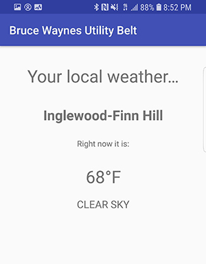
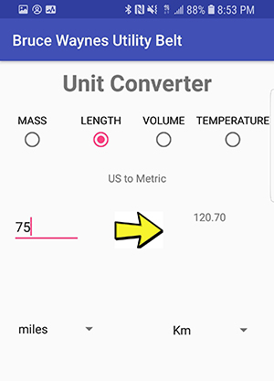

# BruceWaynesUtilityBelt

Android App with 3 main functions

#First is a Tip Calculator

#Second is a Weather Function
This app will locate where you are and give you the current temperature and description of the weather by accessing a weather api.

#Third is a unit converter.
This app will convert US units of mass, length, volume, and temperature and convert them into metric. Here are some examples:

